# 4. Experiments & Results

Generated descriptive results and discussion prompts. Complete the interpretation after the full experiment campaign.

## 4.1 Experimental setup

Three questions: **quality** (final MSE), **speed** (runtime and convergence), and **stability** (variation across independent seeds).

Baseline directory: `elite_one_point_gene_t50_p30_g300_8e05d8cbd25f`. Planned runs/configuration: **5**. Observed baseline seeds: `[1, 2, 3, 4, 5]`.

The main experiment budget means the resources chosen for the final comparisons: a fixed generation limit per run and a planned number of seeds per configuration. Population size is fixed except in its own experiment. This is not a runtime limit and does not guarantee that the GA has converged.

Saved baseline configuration (the random seed varies):

```json
{
  "n_triangles": 50,
  "target_image_path": "/Users/hannahkalager/72.27-Delivery-2/data/flag_100.png",
  "population_size": 30,
  "n_generations": 300,
  "min_error": null,
  "selection_method": "elite",
  "tournament_size": 3,
  "tournament_probability": 0.75,
  "boltzmann_temperature": 1.0,
  "crossover_method": "one_point",
  "crossover_rate": 0.9,
  "mutation_method": "gene",
  "mutation_rate": 0.05,
  "survival_strategy": "additive",
  "extra": {}
}
```

MSE is averaged over RGB channels after dividing pixel values by 255, so it lies in [0, 1]. Lower is better. Fitness is 1/(1 + MSE); per-run fitness is exported to CSV.

Each comparison changes one saved setting relative to the same baseline. Baseline runs are reused across sections and counted once in the overall comparison.

Curves show median best-so-far MSE with IQR (25th–75th percentile), not a confidence interval. Exception: survival curves show current-generation best MSE so losses remain visible. Generation 0 is initialization. SD uses n−1; SD and IQR are omitted for a single run.

GA time (`ga_elapsed_s`) measures only `run_ga`, including initialization and fitness evaluation. Total time (`elapsed`) includes subprocess startup, image loading, GA, plotting and file output. These are separate metrics; legacy runs have no GA timing. No generation timestamps or evaluation counts were saved, so time-to-target and equal-evaluation convergence cannot be reconstructed.

Generation of best is the first minimum observed MSE. A small value can indicate an early plateau at poor quality, so it is not a speed ranking by itself.

Record hardware, software revision, target image dimensions and execution conditions for the full campaign. New runner outputs store target_sha256; legacy runs lack that hash.

### Data coverage

- Some runs lost earlier best solutions: final MSE describes the returned final population. Survival curves show current-generation best MSE; other convergence comparisons show best-so-far MSE.

### Baseline check: understand the repeated runs first

The baseline figures compare seeds of one configuration. They do not compare selection methods, crossovers, mutations, survival strategies, triangle counts or populations. Those comparisons appear below only when alternatives have been run.

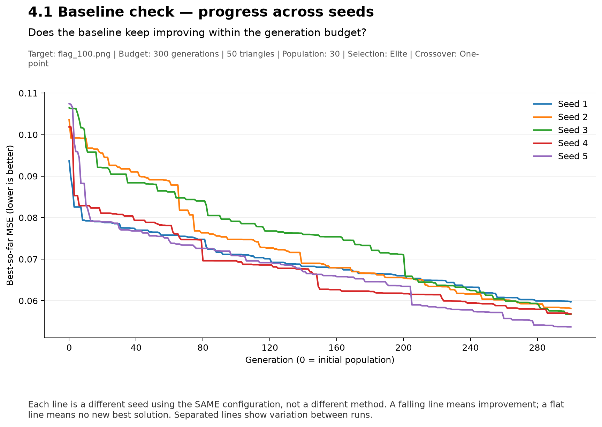

Each line is a different seed using the SAME configuration, not a different method. A falling line means improvement; a flat line means no new best solution. Separated lines show variation between runs.

| Seed | Initial MSE | Final MSE ↓ | GA time (s) | First gen. of best |
| --- | --- | --- | --- | --- |
| 1 | 0.0936385 | 0.0597293 | 4.39025 | 300 |
| 2 | 0.103586 | 0.0581332 | 4.48532 | 300 |
| 3 | 0.10645 | 0.0567773 | 5.08818 | 297 |
| 4 | 0.10186 | 0.0568125 | 4.3572 | 300 |
| 5 | 0.107457 | 0.0537107 | 4.71815 | 298 |

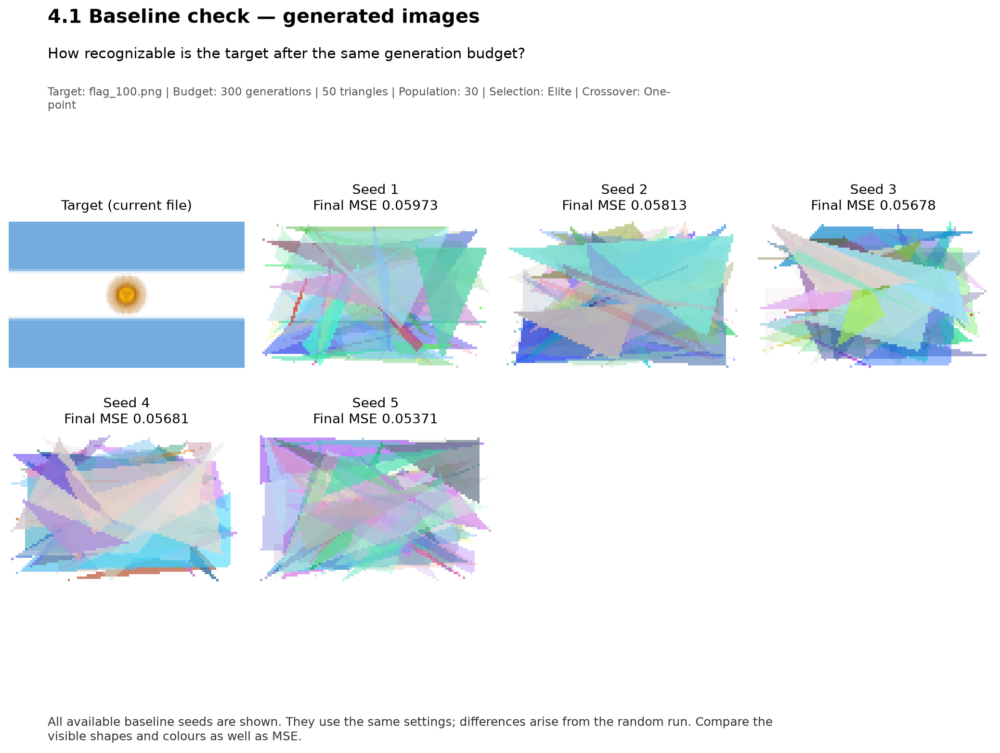

All available baseline seeds are shown. They use the same settings; differences arise from the random run. Compare the visible shapes and colours as well as MSE.

## 4.2 Selection methods

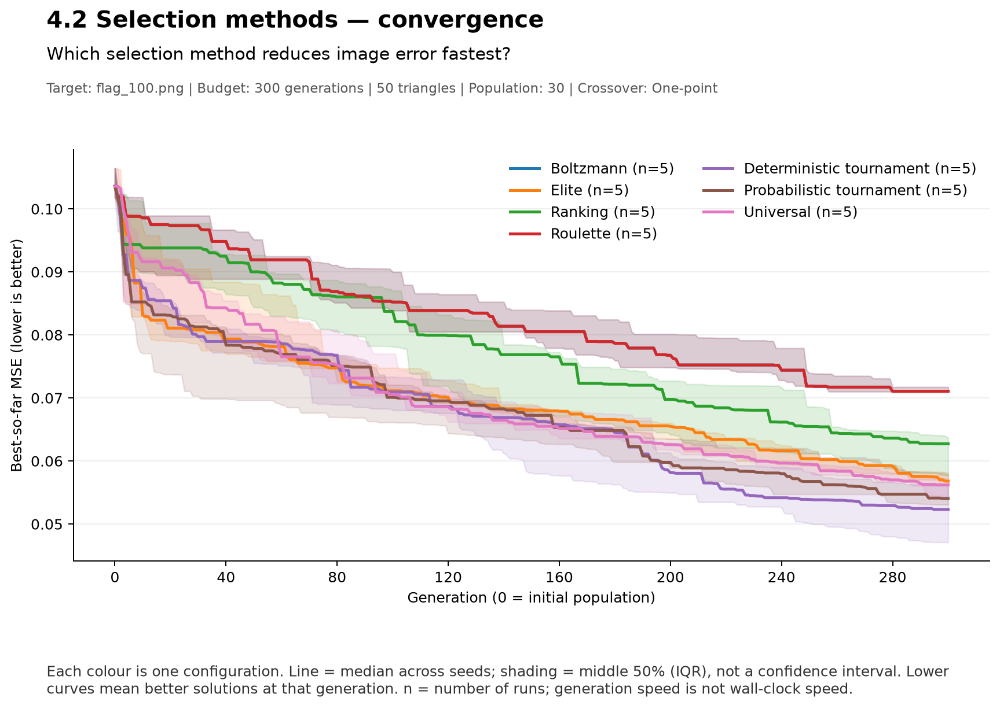

Each colour is one configuration. Line = median across seeds; shading = middle 50% (IQR), not a confidence interval. Lower curves mean better solutions at that generation. n = number of runs; generation speed is not wall-clock speed. 

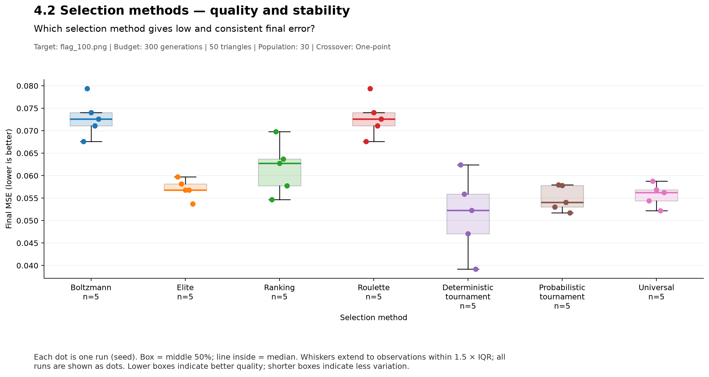

Each dot is one run (seed). Box = middle 50%; line inside = median. Whiskers extend to observations within 1.5 × IQR; all runs are shown as dots. Lower boxes indicate better quality; shorter boxes indicate less variation.

| Configuration | n | Median MSE ↓ | Mean MSE ↓ | Sample SD | IQR | Median GA time (s) ↓ | GA timed n | Median total time (s) | Total timed n | Median gen. of best |
| --- | --- | --- | --- | --- | --- | --- | --- | --- | --- | --- |
| boltzmann | 5 | 0.0726162 | 0.0729396 | 0.00432761 | 0.00292228 | 4.45137 | 5 | 4.98092 | 5 | 274 |
| elite | 5 | 0.0568125 | 0.0570326 | 0.00221541 | 0.00135599 | 4.48532 | 5 | 5.12002 | 5 | 300 |
| ranking | 5 | 0.0627287 | 0.0617148 | 0.00583104 | 0.00596574 | 4.16002 | 5 | 4.68964 | 5 | 298 |
| roulette | 5 | 0.0726162 | 0.0729396 | 0.00432761 | 0.00292228 | 4.31299 | 5 | 4.88758 | 5 | 274 |
| tournament_deterministic | 5 | 0.0523058 | 0.0513759 | 0.00880266 | 0.00882126 | 4.19344 | 5 | 4.74773 | 5 | 300 |
| tournament_probabilistic | 5 | 0.0540402 | 0.054916 | 0.0028576 | 0.00484333 | 4.20506 | 5 | 4.75334 | 5 | 300 |
| universal | 5 | 0.0562142 | 0.0556792 | 0.00249537 | 0.00242286 | 4.25196 | 5 | 4.81776 | 5 | 298 |

**Analysis prompts:** Compare selection pressure and exploration using both the curves and final distributions. Do the seeds support the same tendency? These metrics do not directly measure diversity.

Write your interpretation here, citing measured differences and uncertainty.

## 4.3 Crossover methods

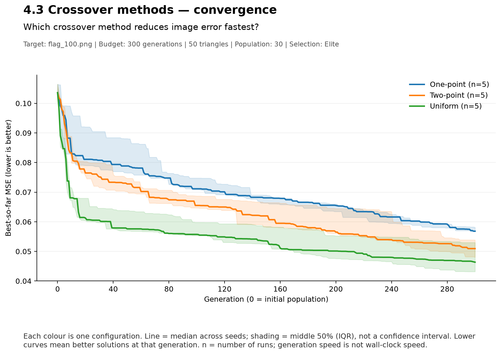

Each colour is one configuration. Line = median across seeds; shading = middle 50% (IQR), not a confidence interval. Lower curves mean better solutions at that generation. n = number of runs; generation speed is not wall-clock speed. 

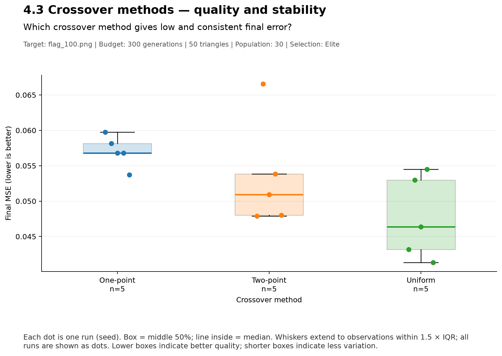

Each dot is one run (seed). Box = middle 50%; line inside = median. Whiskers extend to observations within 1.5 × IQR; all runs are shown as dots. Lower boxes indicate better quality; shorter boxes indicate less variation.

| Configuration | n | Median MSE ↓ | Mean MSE ↓ | Sample SD | IQR | Median GA time (s) ↓ | GA timed n | Median total time (s) | Total timed n | Median gen. of best |
| --- | --- | --- | --- | --- | --- | --- | --- | --- | --- | --- |
| one_point | 5 | 0.0568125 | 0.0570326 | 0.00221541 | 0.00135599 | 4.48532 | 5 | 5.12002 | 5 | 300 |
| two_point | 5 | 0.0509376 | 0.0534539 | 0.00772081 | 0.00584368 | 4.1456 | 5 | 4.70546 | 5 | 296 |
| uniform | 5 | 0.0463544 | 0.047667 | 0.00585507 | 0.00983095 | 4.21045 | 5 | 4.78318 | 5 | 296 |

**Analysis prompts:** Compare quality, convergence and spread. Relate observations to how each operator preserves or recombines the ordered triangle genes and their drawing order.

Write your interpretation here, citing measured differences and uncertainty.

## 4.4 Number of triangles

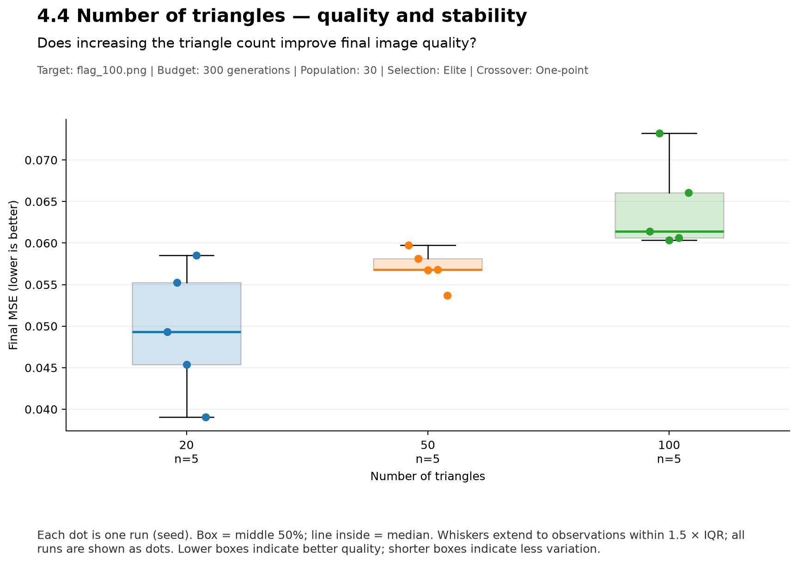

Each dot is one run (seed). Box = middle 50%; line inside = median. Whiskers extend to observations within 1.5 × IQR; all runs are shown as dots. Lower boxes indicate better quality; shorter boxes indicate less variation.

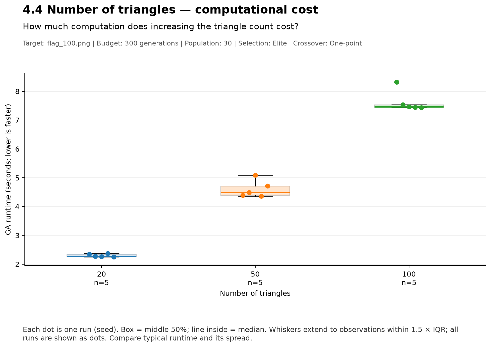

Each dot is one run (seed). Box = middle 50%; line inside = median. Whiskers extend to observations within 1.5 × IQR; all runs are shown as dots. Compare typical runtime and its spread.

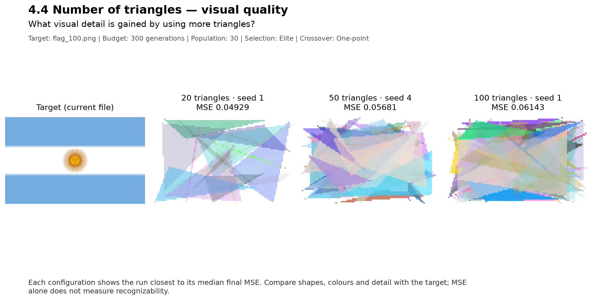

Each configuration shows the run closest to its median final MSE. Compare shapes, colours and detail with the target; MSE alone does not measure recognizability.

| Configuration | n | Median MSE ↓ | Mean MSE ↓ | Sample SD | IQR | Median GA time (s) ↓ | GA timed n | Median total time (s) | Total timed n | Median gen. of best |
| --- | --- | --- | --- | --- | --- | --- | --- | --- | --- | --- |
| 20 | 5 | 0.049292 | 0.0495008 | 0.00774567 | 0.00985962 | 2.27179 | 5 | 2.81611 | 5 | 300 |
| 50 | 5 | 0.0568125 | 0.0570326 | 0.00221541 | 0.00135599 | 4.48532 | 5 | 5.12002 | 5 | 300 |
| 100 | 5 | 0.0614263 | 0.0643433 | 0.00547507 | 0.00546614 | 7.46214 | 5 | 8.01186 | 5 | 300 |

**Analysis prompts:** Compare the MSE improvement with additional runtime and visible differences. More triangles increase representational capacity and the search space. The displayed run is closest to median final MSE, not chosen as the best-looking image.

Write your interpretation here, citing measured differences and uncertainty.

## 4.5 Population size

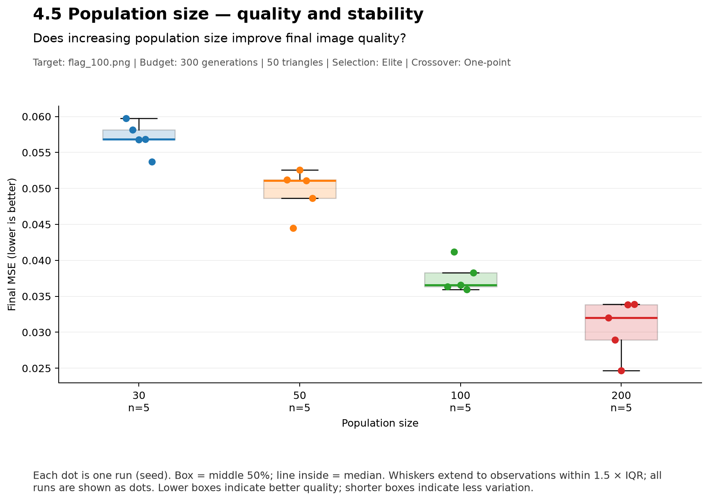

Each dot is one run (seed). Box = middle 50%; line inside = median. Whiskers extend to observations within 1.5 × IQR; all runs are shown as dots. Lower boxes indicate better quality; shorter boxes indicate less variation.

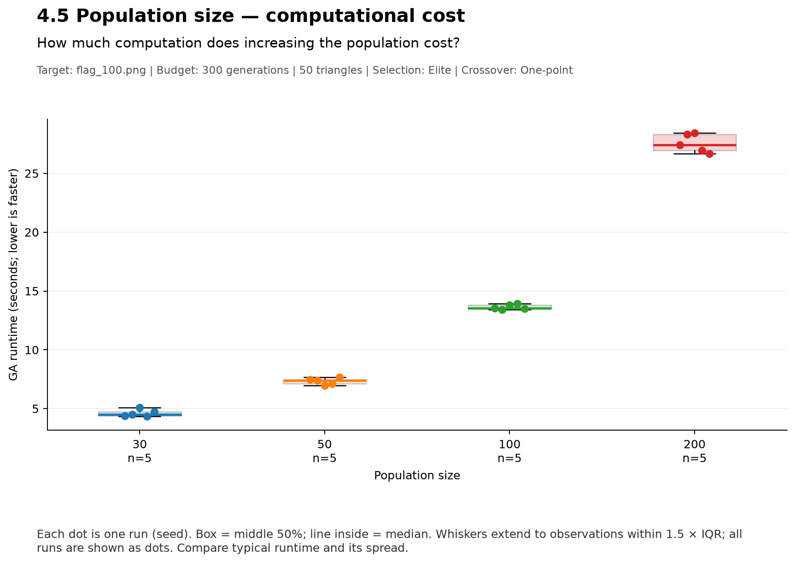

Each dot is one run (seed). Box = middle 50%; line inside = median. Whiskers extend to observations within 1.5 × IQR; all runs are shown as dots. Compare typical runtime and its spread.

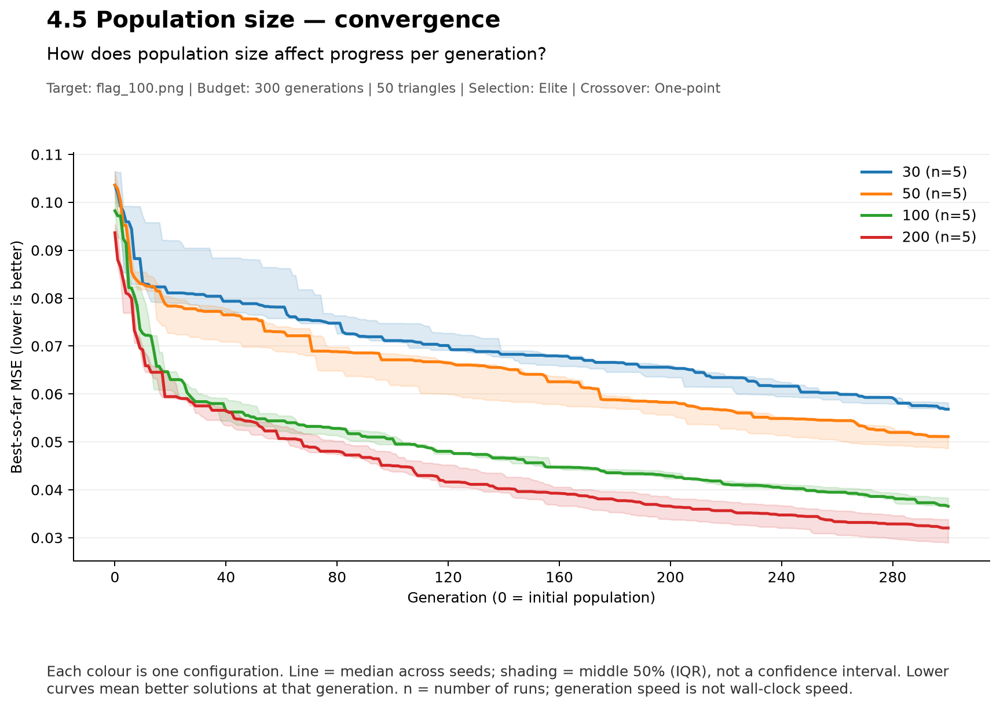

Each colour is one configuration. Line = median across seeds; shading = middle 50% (IQR), not a confidence interval. Lower curves mean better solutions at that generation. n = number of runs; generation speed is not wall-clock speed. 

| Configuration | n | Median MSE ↓ | Mean MSE ↓ | Sample SD | IQR | Median GA time (s) ↓ | GA timed n | Median total time (s) | Total timed n | Median gen. of best |
| --- | --- | --- | --- | --- | --- | --- | --- | --- | --- | --- |
| 30 | 5 | 0.0568125 | 0.0570326 | 0.00221541 | 0.00135599 | 4.48532 | 5 | 5.12002 | 5 | 300 |
| 50 | 5 | 0.0511005 | 0.0496105 | 0.00318551 | 0.00253802 | 7.40422 | 5 | 8.02739 | 5 | 297 |
| 100 | 5 | 0.0365481 | 0.0376695 | 0.00215894 | 0.00192357 | 13.5477 | 5 | 14.1404 | 5 | 299 |
| 200 | 5 | 0.0320182 | 0.0306791 | 0.00389755 | 0.00486236 | 27.4102 | 5 | 28.0783 | 5 | 300 |

**Analysis prompts:** Compare quality gains with runtime and convergence. Equal generations are not an equal computational budget when population size changes; larger populations process more candidates.

Write your interpretation here, citing measured differences and uncertainty.

## 4.6 Survival strategies

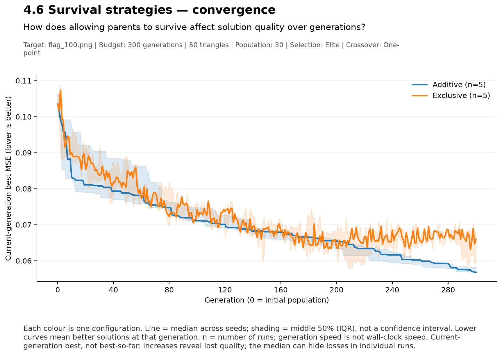

Each colour is one configuration. Line = median across seeds; shading = middle 50% (IQR), not a confidence interval. Lower curves mean better solutions at that generation. n = number of runs; generation speed is not wall-clock speed. Current-generation best, not best-so-far: increases reveal lost quality; the median can hide losses in individual runs.

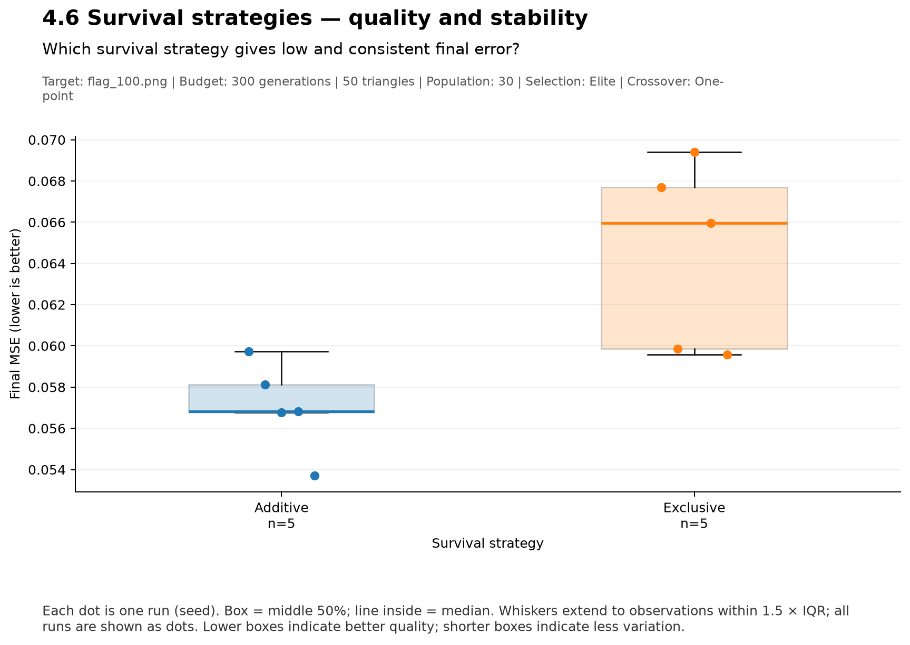

Each dot is one run (seed). Box = middle 50%; line inside = median. Whiskers extend to observations within 1.5 × IQR; all runs are shown as dots. Lower boxes indicate better quality; shorter boxes indicate less variation.

| Configuration | n | Median MSE ↓ | Mean MSE ↓ | Sample SD | IQR | Median GA time (s) ↓ | GA timed n | Median total time (s) | Total timed n | Median gen. of best |
| --- | --- | --- | --- | --- | --- | --- | --- | --- | --- | --- |
| additive | 5 | 0.0568125 | 0.0570326 | 0.00221541 | 0.00135599 | 4.48532 | 5 | 5.12002 | 5 | 300 |
| exclusive | 5 | 0.0659455 | 0.0644937 | 0.00453182 | 0.00785133 | 4.31711 | 5 | 4.85818 | 5 | 211 |

**Analysis prompts:** Compare additive (parents and offspring compete) with exclusive (only offspring survive). Does retaining parents improve final quality and consistency? Compare median GA time too. These curves show current-generation best MSE: exclusive may lose an earlier best solution. The median can hide individual losses; inspect per-seed histories and best_observed_mse in runs.csv. These measurements do not establish population diversity.

Write your interpretation here, citing measured differences and uncertainty.

## 4.7 Mutation methods

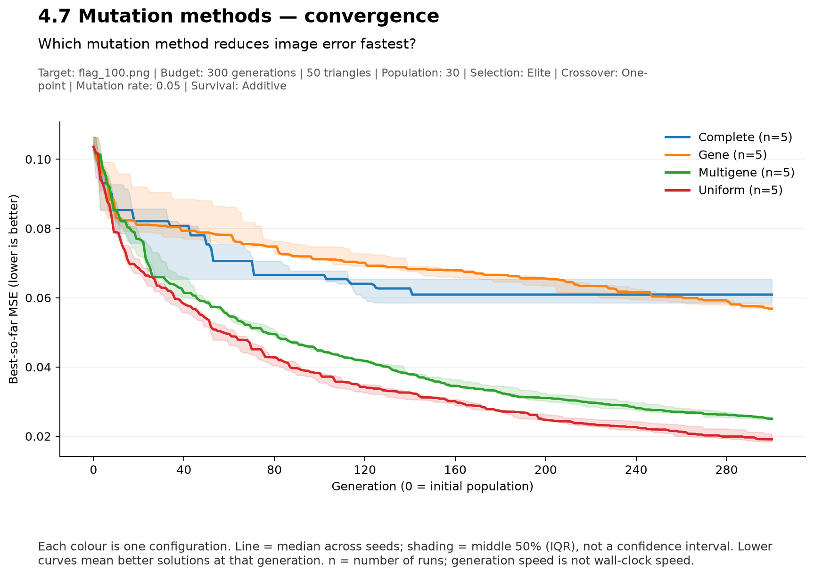

Each colour is one configuration. Line = median across seeds; shading = middle 50% (IQR), not a confidence interval. Lower curves mean better solutions at that generation. n = number of runs; generation speed is not wall-clock speed. 

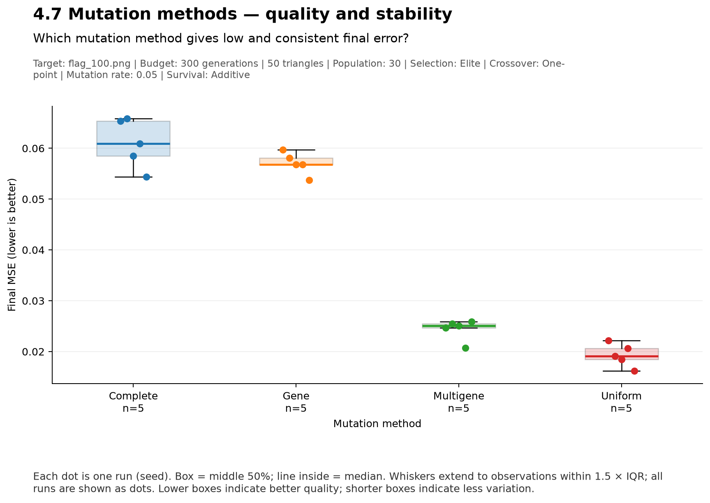

Each dot is one run (seed). Box = middle 50%; line inside = median. Whiskers extend to observations within 1.5 × IQR; all runs are shown as dots. Lower boxes indicate better quality; shorter boxes indicate less variation.

| Configuration | n | Median MSE ↓ | Mean MSE ↓ | Sample SD | IQR | Median GA time (s) ↓ | GA timed n | Median total time (s) | Total timed n | Median gen. of best |
| --- | --- | --- | --- | --- | --- | --- | --- | --- | --- | --- |
| complete | 5 | 0.0609025 | 0.0609937 | 0.00481989 | 0.00687644 | 4.2335 | 5 | 4.78109 | 5 | 129 |
| gene | 5 | 0.0568125 | 0.0570326 | 0.00221541 | 0.00135599 | 4.48532 | 5 | 5.12002 | 5 | 300 |
| multigene | 5 | 0.0250659 | 0.0243877 | 0.00207947 | 0.000813993 | 4.32784 | 5 | 4.87556 | 5 | 299 |
| uniform | 5 | 0.0190991 | 0.0193096 | 0.00223705 | 0.00212891 | 4.37479 | 5 | 4.93122 | 5 | 299 |

**Analysis prompts:** Compare convergence, final quality, seed variation and GA runtime with all other settings fixed. The same numerical mutation rate does not imply the same amount of mutation: gene can change one triangle per individual; multigene tests a random subset; uniform tests every triangle; complete perturbs every triangle when triggered for an individual. Each selected triangle has one coordinate or colour component changed. Relate results to these differences without claiming that diversity was measured directly.

Write your interpretation here, citing measured differences and uncertainty.

## 4.8 Overall comparison

| Configuration | n | Median MSE ↓ | Mean MSE ↓ | Sample SD | IQR | Median GA time (s) ↓ | GA timed n | Median total time (s) | Total timed n | Median gen. of best |
| --- | --- | --- | --- | --- | --- | --- | --- | --- | --- | --- |
| boltzmann_one_point_gene_t50_p30_g300_6e1f0fe7226b | 5 | 0.0726162 | 0.0729396 | 0.00432761 | 0.00292228 | 4.45137 | 5 | 4.98092 | 5 | 274 |
| elite_one_point_gene_t50_p30_g300_8e05d8cbd25f | 5 | 0.0568125 | 0.0570326 | 0.00221541 | 0.00135599 | 4.48532 | 5 | 5.12002 | 5 | 300 |
| ranking_one_point_gene_t50_p30_g300_26cbf9f5bf53 | 5 | 0.0627287 | 0.0617148 | 0.00583104 | 0.00596574 | 4.16002 | 5 | 4.68964 | 5 | 298 |
| roulette_one_point_gene_t50_p30_g300_0f89922a8f3e | 5 | 0.0726162 | 0.0729396 | 0.00432761 | 0.00292228 | 4.31299 | 5 | 4.88758 | 5 | 274 |
| tournament_deterministic_one_point_gene_t50_p30_g300_b4dd43166bda | 5 | 0.0523058 | 0.0513759 | 0.00880266 | 0.00882126 | 4.19344 | 5 | 4.74773 | 5 | 300 |
| tournament_probabilistic_one_point_gene_t50_p30_g300_fa29422fb404 | 5 | 0.0540402 | 0.054916 | 0.0028576 | 0.00484333 | 4.20506 | 5 | 4.75334 | 5 | 300 |
| universal_one_point_gene_t50_p30_g300_3de0012443e8 | 5 | 0.0562142 | 0.0556792 | 0.00249537 | 0.00242286 | 4.25196 | 5 | 4.81776 | 5 | 298 |
| elite_two_point_gene_t50_p30_g300_c377ade44ded | 5 | 0.0509376 | 0.0534539 | 0.00772081 | 0.00584368 | 4.1456 | 5 | 4.70546 | 5 | 296 |
| elite_uniform_gene_t50_p30_g300_fafec42a0d02 | 5 | 0.0463544 | 0.047667 | 0.00585507 | 0.00983095 | 4.21045 | 5 | 4.78318 | 5 | 296 |
| elite_one_point_gene_t20_p30_g300_653808404454 | 5 | 0.049292 | 0.0495008 | 0.00774567 | 0.00985962 | 2.27179 | 5 | 2.81611 | 5 | 300 |
| elite_one_point_gene_t100_p30_g300_58134c689ba0 | 5 | 0.0614263 | 0.0643433 | 0.00547507 | 0.00546614 | 7.46214 | 5 | 8.01186 | 5 | 300 |
| elite_one_point_gene_t50_p50_g300_cc7143c837a0 | 5 | 0.0511005 | 0.0496105 | 0.00318551 | 0.00253802 | 7.40422 | 5 | 8.02739 | 5 | 297 |
| elite_one_point_gene_t50_p100_g300_3cee2b14d3c6 | 5 | 0.0365481 | 0.0376695 | 0.00215894 | 0.00192357 | 13.5477 | 5 | 14.1404 | 5 | 299 |
| elite_one_point_gene_t50_p200_g300_dde8d7e0f718 | 5 | 0.0320182 | 0.0306791 | 0.00389755 | 0.00486236 | 27.4102 | 5 | 28.0783 | 5 | 300 |
| elite_one_point_gene_t50_p30_g300_0b4f51a08c48 | 5 | 0.0659455 | 0.0644937 | 0.00453182 | 0.00785133 | 4.31711 | 5 | 4.85818 | 5 | 211 |
| elite_one_point_complete_t50_p30_g300_348e206b49d8 | 5 | 0.0609025 | 0.0609937 | 0.00481989 | 0.00687644 | 4.2335 | 5 | 4.78109 | 5 | 129 |
| elite_one_point_multigene_t50_p30_g300_05629e3e9f72 | 5 | 0.0250659 | 0.0243877 | 0.00207947 | 0.000813993 | 4.32784 | 5 | 4.87556 | 5 | 299 |
| elite_one_point_uniform_t50_p30_g300_069fbfd0e9a1 | 5 | 0.0190991 | 0.0193096 | 0.00223705 | 0.00212891 | 4.37479 | 5 | 4.93122 | 5 | 299 |

- Quality: lowest median final MSE: **elite_one_point_uniform_t50_p30_g300_069fbfd0e9a1** (0.0190991).

- Speed: lowest median GA runtime: **elite_one_point_gene_t20_p30_g300_653808404454** (2.27179).

- Stability: lowest final-MSE IQR: **elite_one_point_multigene_t50_p30_g300_05629e3e9f72** (0.000813993).

These are descriptive leaders among available configurations, not evidence of a universal winner or statistical significance. See coverage warnings before drawing conclusions. Low variability can mean consistently poor results; assess stability alongside quality.

**Analysis prompts:** Which configuration suits each objective? How large are quality gains relative to runtime and seed variation? Combining preferred settings from individual-factor experiments requires a separate validation experiment.
